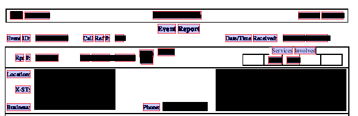

# Using PDFPlumber for PDF data extraction

https://github.com/jsvine/pdfplumber

PDFPlumber is a python tool for extracting data, including table formatted data from PDF files. It also provides visual debugging of the extraction process, unlike many other similar tools.

  - Simple to parse data
  - Table extraction
  - Available in pip
  - VISUAL DEBUGGING!

# Installation

~~~~
pip install pdfplumber
~~~~

For visual debugging, ImageMagick also needs to be installed as described on the PDFPlumber page above.

# Visual Debugging

PDFPlumber allows you visually inspect how the parser sees the documents to refine your optimization.
~~~~
page = pdf.pages[0]
img = page.to_image()
img.draw_rects(page.extract_words())
~~~~

(Actual data has been blured from this example image.)

# Data Extraction Example

For this example data is extracted for an actual project from radio dispatch reports which were provided in PDF form.

~~~~
import pdfplumber
import os
import re
import json
from pprint import pprint
from tqdm import tqdm

all_files = []

for path, subdirs, files in os.walk('/home/user/PDFreports/'):
    for name in files:
        all_files.append(os.path.join(path, name))

all_files = [x for x in all_files if ('_final.pdf' in x.lower()) or ('_final_report.pdf' in x.lower())]
~~~~
Imports and gathering of file names.

~~~~
events = []
for f in tqdm(all_files):
    with pdfplumber.open(f) as pdf:
        lines = []
        lines.append(f)
        for page in pdf.pages:
            text = page.extract_text()
            text = text.split('\n')
            for line in text:
                if 'location: ' in line.lower() or \
                'rpt #:' in line.lower() or \
                'unit:' in line.lower() or \
                'channel:' in line.lower() or \
                'code:' in line.lower() or \
                'response:' in line.lower() or \
                'complaint:' in line.lower() or \
                'nature:' in line.lower() or \
                'business:' in line.lower() or \
                'date/time' in line.lower():
                    lines.append(line.strip())

        events.append(lines)

100%|██████████| 1726/1726 [09:43<00:00,  3.04it/s]
~~~~
For this sample, there wasn't a lot of overly complex formatted data, so the needed data could be found by examining the lines of text extracted from the file.

~~~~
all_evts = {}
for counter, event in tqdm(enumerate(events[:])):
    evt = {}
    for line in event:
        line = line.strip()

        # --- removed for brevity ---

        match = re.match(r'(Nature:)(.*)(Alarm Lvl:)(.*)(Priority:)(.*)(Event Priority:)(.*)$', line)
        if match:
            evt['nature'] = match.group(2).strip()
            evt['alarm_level'] = match.group(4).strip()
            evt['priority'] = match.group(6).strip()
            evt['event_priority'] = match.group(6).strip()

        # --- removed for brevity ---

        all_evts[counter] = evt

1726it [00:00, 6206.80it/s]
~~~~
The extracted lines could then be parsed using python's excellent regex support to isolate the needed data.

~~~~
with open('cad.json', 'w') as outfile:
    json.dump(all_evts, outfile)
~~~~
And export the data for use as a JSON file.
